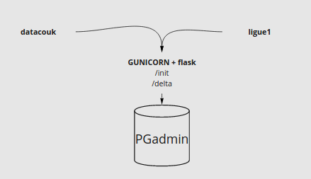

# S'amuser avec les datas des championnats de football francais

L'objectif est dans un premier temps de collecter les datas issus des sites:
- https://www.football-data.co.uk/ => récupération entres autres des résultats et des côtes sur les sites de paris pour chaque match.
- https://www.ligue1.fr => récupération des classements, résultats et forme des équipes sur le site officiel du championnat francais.

Utilisations identifiées:
- Dataviz (Apache Superset)
- Prédiction avec algos de ML

## Architecture du projet

- Scrap: sélénium + donwload csv 
- Flask 
- Pg admin




ps -ef  | grep gunicorn


# Créer l'environnement virtuel 
```bash
python3 -m venv .venv
```

```bash
source ./venv/bin/activate
```

```bash
pip install -r requirements.txt
```

